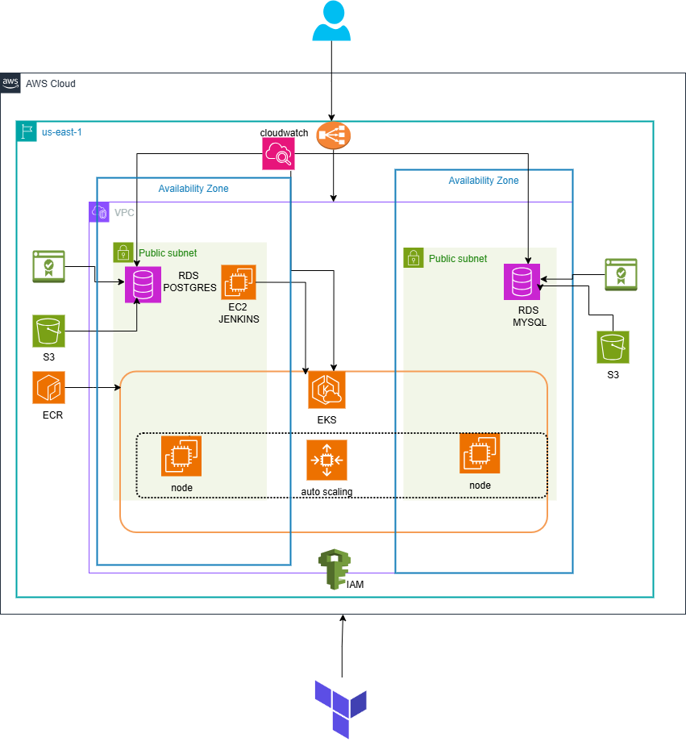

# Fintech-Infrastructure

This repository contains the Terraform configuration for deploying a microservices-based infrastructure on AWS for the Fintech project. The architecture is designed for scalability, high availability, and observability, using AWS services such as EKS, RDS, S3, and others. The infrastructure is modular and divided into multiple components for easier management.

## Architecture Overview

The infrastructure consists of the following components:

- **AWS VPC**: The base networking layer, including public subnets across multiple availability zones.
- **Amazon RDS**: Database instances for PostgreSQL and MySQL.
- **Amazon EKS**: Kubernetes cluster for deploying and managing microservices.
- **Amazon S3**: Object storage for static files and backups.
- **Amazon ECR**: Container registry for Docker images.
- **EC2 Jenkins**: CI/CD pipeline using Jenkins.
- **IAM**: Secure access and permissions management.
- **CloudWatch**: Monitoring and logging for observability.

### Architecture Diagram

Below is the high-level architecture diagram of the system:



## Components

### ECR
This module provisions an Amazon Elastic Container Registry (ECR) for storing Docker images.

### EKS, RDS, and S3
This module includes the setup for:
- Amazon EKS for container orchestration.
- Amazon RDS for PostgreSQL and MySQL database instances.
- Amazon S3 for object storage.

### Jenkins
This module sets up an EC2 instance running Jenkins for CI/CD pipelines.

### VPC and Security Groups
This module configures a Virtual Private Cloud (VPC) and related security groups to ensure secure communication between resources.

## Prerequisites

- Terraform v1.4+
- AWS CLI configured with proper access credentials
- Access to an AWS account


## How to Use

1. Clone the repository:
   ```bash
   git clone https://github.com/yourusername/fintech-infrastructure.git
   cd fintech-infrastructure
   ```

2. Initialize Terraform:
   ```bash
   terraform init
   ```

3. Review and apply the changes:
   ```bash
   terraform plan
   terraform apply
   ```

4. Follow the prompts to confirm the deployment.

## AWS Services Used

- **Amazon VPC**: Networking layer.
- **Amazon EKS**: Kubernetes cluster.
- **Amazon RDS**: Relational databases (PostgreSQL, MySQL).
- **Amazon S3**: Storage for backups and static files.
- **Amazon ECR**: Docker image registry.
- **Amazon EC2**: Compute resources for Jenkins.
- **CloudWatch**: Logging and monitoring.
- **IAM**: Access and identity management.

## Contributing

If you'd like to contribute, please create a pull request with your changes and include a description of the update. All contributions are welcome.

## License

This project is licensed under the MIT License. See the LICENSE file for details.

---
